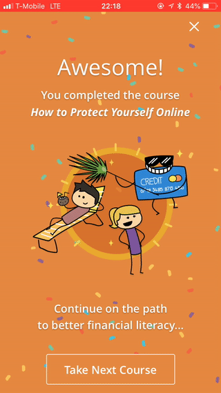

I recently logged into my [Arrow Card iOS app](https://itunes.apple.com/us/app/arrow-card/id1228440036?mt=8) to check my balance and was pumped to discover that my team's Spring 2017 Hackathon project branch was finally merged and released.

Here it is, in all its cartoon-y glory: the [LendUp Education](https://www.lendup.com/education) mobile feature.

[Arrow Card](https://www.lendup.com/card) holders can watch educational videos about improving their credit scores, budgeting, saving, and other personal finance tidbits, followed by a quick multiple choice quiz, followed by CONFETTI 🎉:

Pooja, Beckman, and I'm pretty sure one other person who I can't remember right now (sorry!) built this feature in a little less than a day, thanks to the power and glory and ergonomic bliss of [React Native](https://facebook.github.io/react-native/). 

Somehow, we lost the hackathon to a chatbot. I'm not *that* bitter. I definitely would have enjoyed the taste of victory (and some of that oh-so-comfy LendUp swag), but at least our feature got released 🙏.