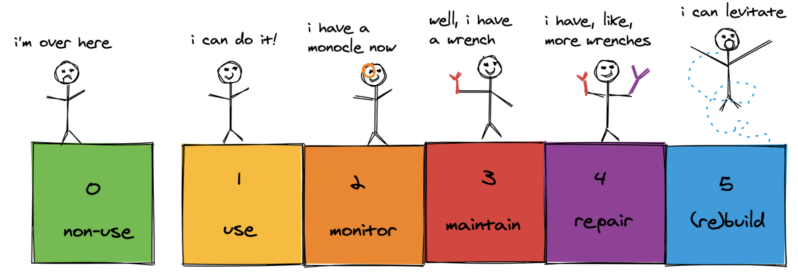
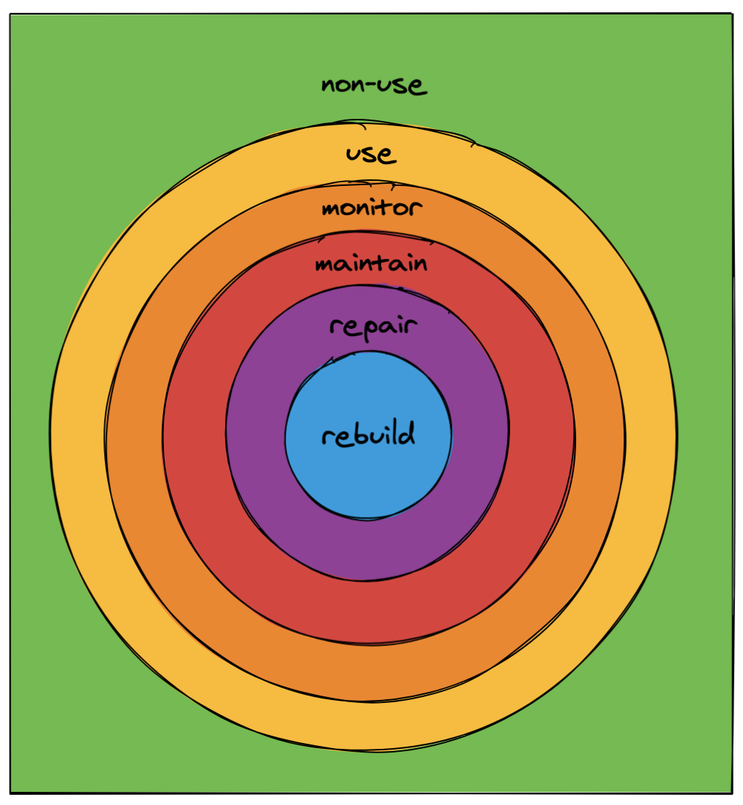

We recently borrowed our friends' car, because they're awesome. Along with the keys, they gave us *a few, uh, provisos, a, a couple of quid pro quos:*1

* The car takes the expensive kind of gas
* The trunk doesn't always open up from the outside
* The dash says the tail-light is out, but it's not
* You'll need to add more oil every 100 miles or so, and it might need an oil change

I nodded throughout. Yup, needs prem-o gas. Trunk's weird, okay. Tail-light-light's-not-alright, good to know. Oil, yes, oil's a thing that cars need.

Meanwhile, I caught myself thinking, "Man, they really know a lot about cars."

I, for one, don't. My dad knows how to take a car apart and put it back together. I know how to get 120 stars in Super Mario 64. Sure, I learned *some stuff* about cars growing up. I've changed flat tires in a pinch, once helped my dad replace brake pads on our monstrous Suburban, and sorta payed attention while I helped him change the oil in Old Blue (his beloved sky blue '85 Blazer).

Fact is, I've never owned a car in my adult life (hello, city-living). For those intermittent and unavoidable road trips, I've been a semi-content customer of Zipcar. I never been forced to face the reality of **learning cars**.

But, sure, I'd like to!

Even now, I'm starting to fantasize about acquiring the rusted hulk of a old Volkswagon Beetle, depositing it via crane into my garage workshop lair, tearing it apart and rebuilding it anew from first principles, as I both rediscover the invention of internal combustion and manufacture one pretty-sweet ride.

Where does this fantasy come from? Well, I've been told that Beetles have a relatively straight-forward engine for beginners (though I'm not quite sure what exactly that means). But that's not quite it. Frankly, this is an all-to-familiar headspace for me. Intimidated by the mention of changing oil, my brain races ahead rebuilding a car from scratch in order to understand ... why I needed to change the oil in an entirely different car.

Why do I jump all the way to wanting to understand things from first principles?

Maybe because this has been a successful way for me to learn programming as an adult, and I'm now pattern-matching into other complex systems. But, certainly, I should be able to productive with a system far in advance of knowing how to build it from scratch. Isn't that what interfaces are all about?

Which brings me to the following shower thought:

## The Six Levels of Interaction with Systems

The six levels of interaction with a system are:

0. Non-use
1. Use
2. Monitor
3. Maintain
4. Repair
5. (Re)build

Yes, this is zero-indexed, obviously. Want to see it as a Ben Thompson [Stratechery-style](https://stratechery.com/) diagram?

My thanks to the [Excalidraw web app](https://excalidraw.com) for their excellent box drawing tool. While I'm at it, should I add some [Wait But Why-style](https://www.waitbutwhy.com) little stick figures?

Not funny enough? How about a concentric-circle approach? That probably makes more sense, anyway.

Yes, those are the vintage Apple logo colors, because I literally cannot help myself (it was hard enough not to write another post about [my Apple IIe](/my-new-old-apple-iie-computer)).

Let's go through the levels them one-by-one, continuing our use of a car as the example.

### Level 0: Non-use

You can't use the system. You don't know how to drive the car.

### Level 1: Use

You can use the primary purpose of the system. You know how to drive a car safely. You can go in reverse. You can pass a driver's test.

### Level 2: Monitor

You know how to observe secondary signals from the system. In our car, you know to occasionally review the dashboard for things like the engine light. You don't necessarily know what to do about these signals, but you know they are *a thing*, and will probably *mention* them to someone like a mechanic (but, hey, no guarantee).

### Level 3: Maintain

You are comfortable enough with the previous monitoring signals and your own "handy-ness" (is that a word?) to do routine maintence on the system. You add more washer fluid when it gets low. You replace the dead battery. You add air to your tires at the gas station.

### Level 4: Repair

You know how to fix sub-systems in the overall system. Not necessary all of them, but the most important ones (probably the ones that break most often). You can change a tire. You can replace brake pads. You can fix a broken headlight.

### Level 5: (Re)build

You know how to tear apart the system completely and re-build it from scratch. You understand each sub-system, why it's there, and how to make them all work together. You can take apart the Volkswagon Beetle and put it back together. You can levitate.

## Other examples

> Sure, Charlie, that worked conveniently for your car example. But what about... other stuff?

Great question!

How about investing?

0. **Non-use**: Don't invest anything
1. **Use**: Invest some money and be able to check-in your returns
2. **Monitor**: Compare your returns with alternative investments
3. **Maintain**: Make slight adjustments based on these alternatives
4. **Repair**: Fix gaping holes or major problems in your investing strategy
5. **Re(build)**: Design a custom investment strategy for you (or anyone else)

Okay, admittedly **Repair** and **Rebuild** blended a bit there. But I think that's fine. 

**In fact, the lines between these levels are meant to be porous**. A Level 3 could probably do some serious Level 4 stuff. Even a Level 0 non-user *probably* knows enough from pop-culture and context clues to be a Level 1 user, with the proper motivation.

Let's try another example: using a desktop computer!

0. **Non-use**: Don't know how to use a computer. They're evil!
1. **Use**: Can use a computer to do stuff (go online, write a document, print it out, use a spreadsheet, play Minecraft)
2. **Monitor**: Notice that your browser is slower than normal or that you are running out of hard drive space
3. **Maintain**: Empty your "trash bin", delete old unused apps
4. **Repair**: Remove that sketchy ad company browser extension from your parent's computer. Restore your computer's data from a backup drive.
5. **Re(build)**: Take apart a computer, install new hard drive, re-install operating system.

I suppose with that example we transitioned from a non-computer-user all the way to computer technician. It's patently obvious that there are levels of understanding even beyond our Level 5 skill of being able to "take apart a computer and install something new in it." Like, how does a hard drive even work? How does memory work? What is physics? What is truth? 

The onion is infinite. But these outer levels may prove useful as you encounter unknown systems. 

There's often money to be made for more advanced "Levels" to sell their skills to lower level-ers. I'm not going to fix a cavity myself - I'm going to pay an expert, a Level 5 dentist to do it. In a pinch, a desert-island pinch, I'm sure I could figure out how do some Castaway-style dentistry. But I'm not (yet) on a desert island, and I don't want to take the time to go beyond a Level 3 in the kinda-gross system that is my own teeth situation. I'll floss, mostly every day, which puts me squarely in Level 3. The bet I'm making is that my time doing Level 3 work will be worth it, given the effort, compared to my toothless friends in the preceeding levels.

## So, what's the right way to learn a new system?

I don't know! 

On one hand, knowledge stacks on previous or prerequiste knowledge. It's probably helpful to know about arithmetic before tackling algebra.

On the other hand, if all you ever want to do is "use" something, use the system for its primary intended purpose, maybe it's not worth digging deeper -- at least not initially. When we learn how to drive, we don't start with a box of car parts and the skeleton frame of a burned out Cheverolt (as much as I wish we did). No, we got behind the wheel (after watching countless VHS tapes of instructional material) and learned how to drive. We straight-up Level 1'ed that car.

The question to consider is: what's your goal? 

Your answer should guide where you should set your North Star in the onion-level-spectrum-chart-thing.

### A note on instructional design

Great courses and great teachers take a strong viewpoint towards this question.

Sal Khan of [Khan Academy](https://www.khanacademy.org/) seems to take the former approach, stacking layers of prerequisite knowledge nuggets in a knowledge graph that goes from counting to category theory, and everywhere in-between. Their approach makes learning math trackable and digestible, relying on momentum, quick wins, and gameification to keep students motivated.

Whereas, [Jeremy Howard](https://www.fast.ai/about/#jeremy) and [Rachel Thomas](https://www.fast.ai/about/#rachel) of the [Fast.ai deep learning course](https://course.fast.ai/) go straight for Level 1, making students feel comfortable "using deep learning to do cool things first", and then and only then start peeling back the layers (good word choice here, I think, given the context) to the complexities beneath the surface.

In both cases, it's about finding the right way to motivate your students. There's no right answer. In fact, I adore both of these courses and projects, even if I think I failed as a student in both of them. In the case of Khan Academy, I lost motivation because there's too much to learn and not enough time to completely do my math-life over (as much as I want to). In the case of fast.ai, I became too self-conscious about linear algebra (a skill that's well past Level 1 stuff).

### "What's next?" asked the life-long learner

Is this six-levels thing a brilliant and new grand unified theorem of learning systems? No, of course not. I'm probably butchering some existing theorem from an oversized coffee-table-sized book about mental models. But isn't that the point of mental models, so you can re-use them?

For me, this "thereom" (I'm still going to call it that) helps me think about priorities. Which systems do I want to become Level 5 in over the next few years?

Is it this car? Probably not. But I'll still watch some YouTubes so that I can figure how to put more oil in it.

#### Footnotes

1. No actual quid pro quos were exchanged. I merely wanted to quote the Genie.