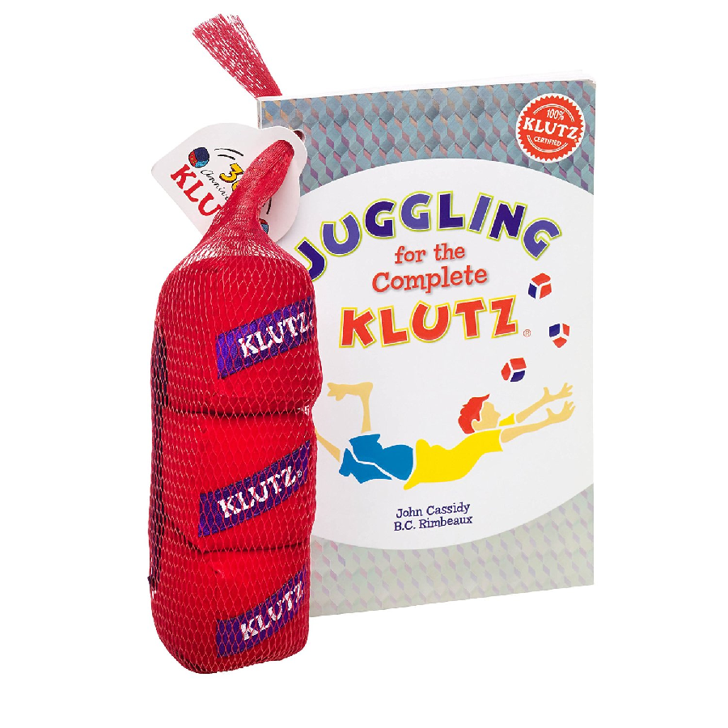
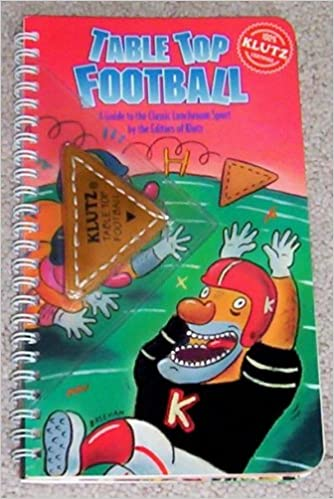
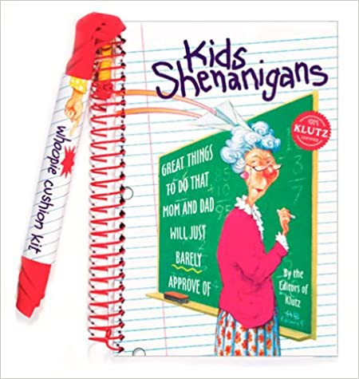

> Create wonderful things, be good, have fun

This is the credo of Klutz Press, the most important book publisher of my childhood. It being summer and all, Hobbes, ol' buddy... let's going exploring!

## The magic of a Klutz book

If you've heard of Klutz, then you've likely seen their debut: [Juggling For the Complete Klutz](https://www.amazon.com/gp/product/0932592007/ref=as_li_qf_asin_il_tl?ie=UTF8&tag=whatrocks09-20&creative=9325&linkCode=as2&creativeASIN=0932592007&linkId=adaa512e8af09feab7c571ec8f2863cc). 

If not, I highly suggest seeking out a copy. Keep in mind, it's more than just a *book* -- *Juggling for the Complete Klutz* has these amazing attributes:

* It's spiral-bound
* It has hilarious drawings
* It comes attached with three real-life bean bags!

These are book super-powers, in my book (a Klutz-worthy pun?). In our day, my sister and I owned, devoured, and treasured these Klutz titles:

* [Country and Blues Harmonica for the Musically Hopeless](https://www.amazon.com/gp/product/0932592082/ref=as_li_qf_asin_il_tl?ie=UTF8&tag=whatrocks09-20&creative=9325&linkCode=as2&creativeASIN=0932592082&linkId=5bb878d785a02edc2b01eeffd63f9a76) (comes with instructional cassette and a gen-u-ine Hohner harmonica)
* [Friendship Bracelets Craft Kit](https://www.amazon.com/gp/product/1591747007/ref=as_li_qf_asin_il_tl?ie=UTF8&tag=whatrocks09-20&creative=9325&linkCode=as2&creativeASIN=1591747007&linkId=bf0dda95c016b59824316ebe42f872ec) (comes with string and supplies for making friendship bracelets)
* [Table Top Football: A Guide to the Classic Lunchroom Sport](https://www.amazon.com/gp/product/1878257501/ref=as_li_qf_asin_il_tl?ie=UTF8&tag=whatrocks09-20&creative=9325&linkCode=as2&creativeASIN=1878257501&linkId=7315967f85fba1c812b20b480b0bd966) (comes with an amazing leather-ish table top football)
* [Cats Cradle](https://www.amazon.com/gp/product/1878257536/ref=as_li_qf_asin_il_tl?ie=UTF8&tag=whatrocks09-20&creative=9325&linkCode=as2&creativeASIN=1878257536&linkId=58c3235cd298baf5ec29fb13ee806ced) (comes with a tie-die cat's cradle string)
* [Bead Loom Bracelets: Learn to Make Beautiful Beaded Bracelets](https://www.amazon.com/gp/product/1591745047/ref=as_li_qf_asin_il_tl?ie=UTF8&tag=whatrocks09-20&creative=9325&linkCode=as2&creativeASIN=1591745047&linkId=905fbe99f4844c375f00baa92f1beee0) (comes with beads and string)
* [Kids Shenanigans](https://www.amazon.com/gp/product/1878257412/ref=as_li_qf_asin_il_tl?ie=UTF8&tag=whatrocks09-20&creative=9325&linkCode=as2&creativeASIN=1878257412&linkId=d283508248a4016cd908bd8e37fcea68) (comes with a Whoopie cushion!)
* [Earthsearch: A Kid's Geography Museum in a Book](https://www.amazon.com/gp/product/1878257749/ref=as_li_qf_asin_il_tl?ie=UTF8&tag=whatrocks09-20&creative=9325&linkCode=as2&creativeASIN=1878257749&linkId=99f448476dd4b6ce6baae76dbf048446) (comes with interactive spinners, a sand-powered clock, and a real-life penny)
* [Explorabook: A Kid's Science Museum in a Book](https://www.amazon.com/gp/product/1878257145/ref=as_li_qf_asin_il_tl?ie=UTF8&tag=whatrocks09-20&creative=9325&linkCode=as2&creativeASIN=1878257145&linkId=6b93493aa3d2cd5660e5e24c404ad5e6) (comes with a bunch more interactive projects and whatnots inside the book, like mirrors, spinners, and a packet of algae that you can grow)

As a kid, there was nothing better than getting a new Klutz book (ok, maybe a Super Nintendo game). But unlike a replay of *Super Mario RPG*, these Klutz books require no nostaglia goggles. Here's why I think they're magic:

### Klutz books are spiral-bound

Books for learning stuff should be able to open up and stay flat. The old 1980s computer manuals for computers like the Commodore VIC-20, the Commodore 64, and [my new old Apple IIe](/my-new-old-apple-iie-computer) knew this much -- their manuals were spiral-bound and spell-binding.

So, why don't we see more spiral-bound books? Without knowing that much about printing costs, I imagine they're more expensive. Also, they do look slightly worse on a bookshelf, especially if you're going for that 'grammable color pattern look (so, just don't do this).

### Klutz books come with the required materials

The little "paper" football that came with the *Table Top Football: A Guide to the Classic Lunchroom Sport* was a revered grail of mine. I remember that my dad took a sheetrock knife and made a small incision in its plastic case attached to the book so that the football could be slid in and out, with the explicit rule that the football must either be *in the case* or *being used in a game*. This is much like the inexorable [Jon Siracusan](https://hypercritical.co) rule for Airpods. Obey, or the Airpods will be instantly lost forever.

Side note that there are some people who just love making small cuts into the plastic cases for things, so that you easily return them to their "pristine" condition. I, myself, don't understand these people. I like wripping these cases to shreds instantly.

Anyway, back to these Klutz books. By including juggling bean bags, yarn for friendship bracelets, or a real harmonica, Klutz Press books gave you everything you needed to get your hands dirty. "Active learning", or something like that. Playing = learning. Etcetera.

### Klutz books have hilarious art

Just look at that paper airplane stuck in the teacher's hair!

Klutz had a particular art direction that spoke to me as a child. The goofy people in their guides made me feel like it was *okay to be a klutz*. 

Which brings me to the most important reason that Klutz books are special.

### Klutz books embrace the Beginner's Mindset

> In the beginner's mind there are many possibilities. In the experts mind there are few - Shunryū Suzuki

Everyone starts out as a klutz. No matter what. That means it's okay to make mistakes. It can even be funny - in fact, it should be funny! Because it's fun to learn new things.

Being a klutz, making mistakes, having fun, this is the path to wonderful things.

## Who's behind Klutz Press?

According to [Wikipedia](https://en.wikipedia.org/wiki/Klutz_Press), Klutz Press was founded in 1977 by three friends in Palo Alto.

The apocryphal story is that [John Cassidy](https://en.wikipedia.org/wiki/John_Cassidy_(author)), a recent Stanford grad working as a high school teacher, brought a bucket of tennis balls and some hand-written instructions for juggling to his remedial reading class. The laughs and learning and genuine reading and genuine juggling that ensued inspired Cassidy and his buddies from Stanford to publish *Juggling For the Complete Klutz* under their new company: Klutz Press.

*Juggling For the Complete Klutz* has sold over 2.5 million copies. But Googling for Klutz Press is somewhat challenging these days. In 2000, Klutz was acquired by a company called Nelvana for $74 million, and in 2002 Klutz became a subsidiary of Scholastic, Inc. This latter merger is a good match in my book, as the Scholastic Book Fair also ranks heavily in my childhood memories of learning to love reading. The only other company I'd feel comfortable with owning Klutz Press is Pizza Hut - thanks to their delicious [BOOK-IT!](https://www.bookitprogram.com/) reading program, which brought me dozens of delicious cheese Personal Pan Pizzas during the 1990s. My parents couldn't decide if they hated or loved Pizza Hut for this.

Nowadays, Klutz.com redirects to the Scholastic website, and it's unclear what's out-of-print or available from the voluminous Klutz catalog. So if you do find a genuine Klutz book and kit, I'd snag them quickly!

Luckily, I was able to find a good interview with Cassidy from 1995 on the [Wayback Machine](https://web.archive.org/web/20110616182712/http://findarticles.com/p/articles/mi_m1154/is_n5_v83/ai_16857996/). In 1995, Klutz was at the height of their power and influence in kid's minds. Here are some choice quotes from Cassidy:

On their company culture at Klutz Press:

> "In terms of being laid back, we take a back seat to nobody."

On their "teaching" style:

> "Talk to a kid about fun and math, and it's like you're talking about two different sides of the universe. If we can climb this mountain, there's nothing we can't tackle."

> "Kids don't learn all that much by listening or reading. They need to get elbow-deep in a subject and touch it, feel it, and smell it."

This reminds me of Seymour Paypert's [Mindstorms book](https://www.amazon.com/gp/product/0465046746/ref=as_li_qf_asin_il_tl?ie=UTF8&tag=whatrocks09-20&creative=9325&linkCode=as2&creativeASIN=0465046746&linkId=2949aefc36d4bd9d9f632170d2ac23de) about his work with LOGO and the Turtle machine (you can check out [my notes](/mindstorms) on the book)

The article explains a bit about their business:

* All of Klutz' books sell for less than $20
* They can have low prices because: (1) the books (with their accompanying "stuff") are viewed as more than books - but "toys/novelties", so more retailers than booksellers are interesting in carring them, and (2) they do large printing runs (150k copies vs the usual 10k for children's books)

And, importantly, the final word from Cassidy:

> "I can hang a spoon off my nose," Cassidy boasts, "and I take a lot of pride in that".

## Create wonderful things, be good, have fun

I just wanted to write that out again. I've decided to adopt their credo as my own life motto.

I learned so much from Klutz Press as a kid. I'm still learning now. Thank you, John Cassidy and team, for making these wonderful books. My juggling is finally starting to get pretty good, but I'll always be a klutz.
