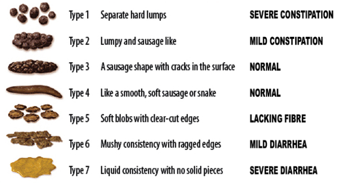
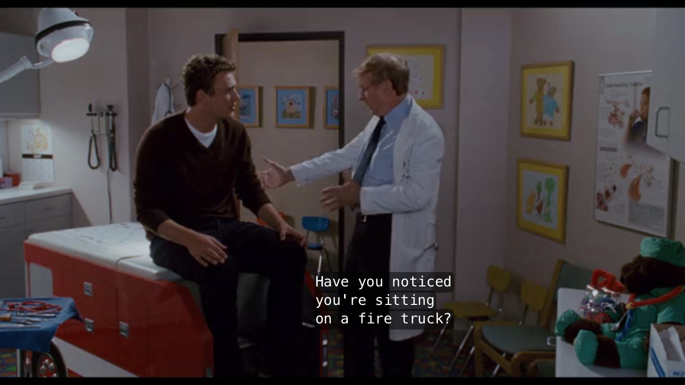
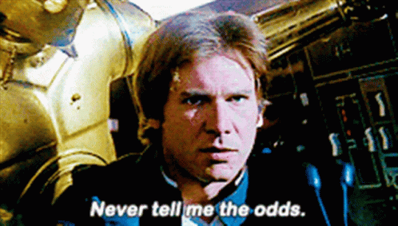
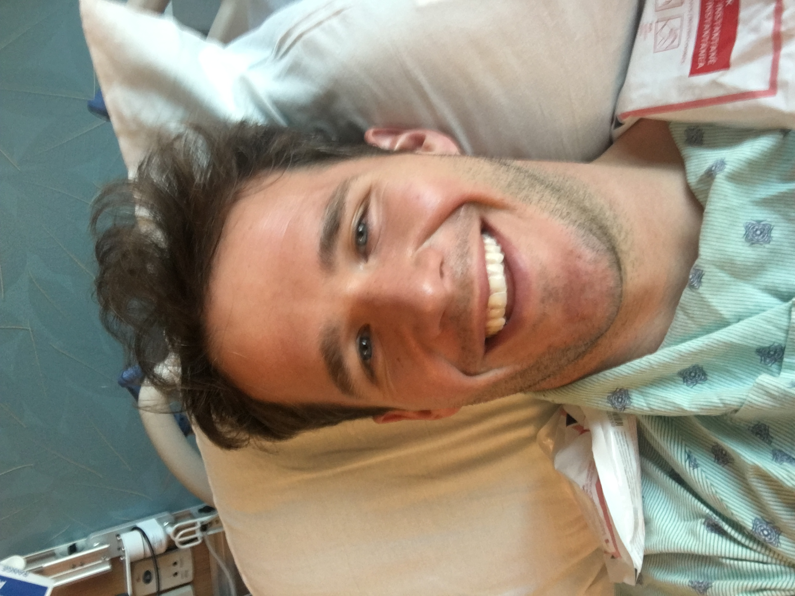
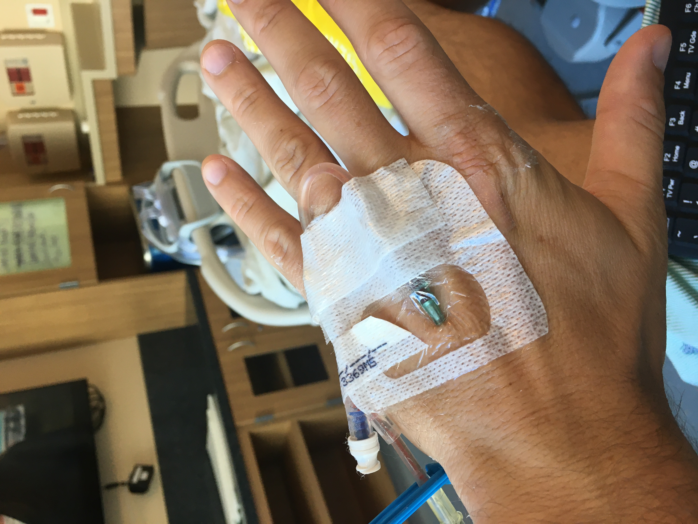
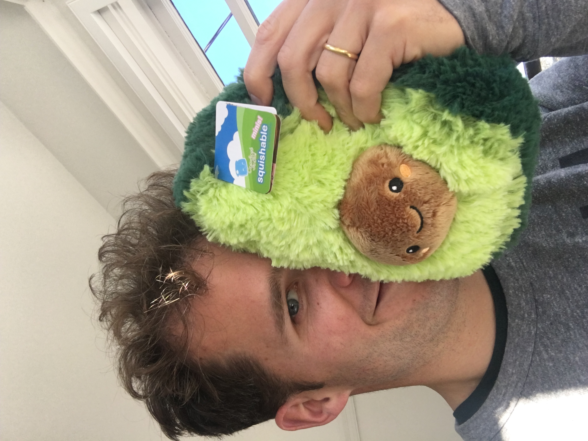
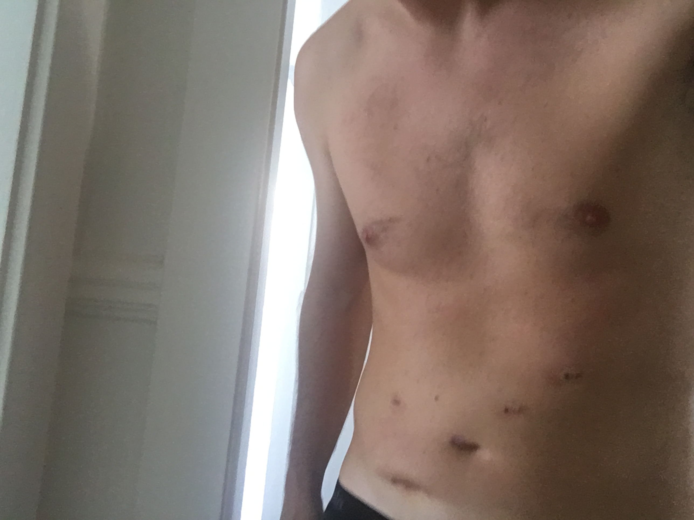

The giant robot looks like a WED Treadwell, [my favorite robot](/robots-i-love) of all the Star Wars droids. I was worried that it would look organic, like a Sentinel from The Matrix, with wriggling Dr. Octopus arms and pinchy pincers that pinch. But I'm calmed by the robot's EVE-like exterior.

The room is sterile. A dozen masked, gloved attendants in blue buzz. I imagine I'm an astronaut about to step into the rocketship capsule.

Except I won't be going anywhere on this particular journey, unless something goes very, very wrong. In fact, I've already been asked repeatedly by various staffers to describe what I'm expecting to happen in this room over the next few hours:

> "I'm here to remove my sigmoid colon via robotic surgery because of the cancerous tumor inside."

I'm 34 years old. It's October 12th, 2020. Five weeks ago I was diagnosed with colon cancer.

## Stool, bloody stool

I've always been a standing wiper. Not sure entirely why. I must have once, accidentally, touched a load of poo during a seated wipe. That sort of thing can change a person.

This charming anecdote does factor into our story, because it means I've always had a pretty good sense for my poo. Consistency, quality, and color, both in the bowl and on the TP. Don't tell me you haven't ever been impressed with your output. Why do we bother eating corn, for example. There's even a seven-stage scientific classification system for your poo, called the [Bristol stool scale](https://en.wikipedia.org/wiki/Bristol_stool_scale), but I'm not that into it, okay?

I first noticed blood two or three years ago. On a monthly or so cadence, I'd wipe and notice a reddish tinge. Not bright red, more like muddy-red. Poopy-red. Initially, I thought little of it. Just a minor curiousity. It certainly didn't happen every time. Still, I decided to check off the `Blood in stool` box on the forms at my annual physical with my primary care doctor that year.

A brief aside on the phrase "your primary care doctor". Like in *Forgetting Sarah Marshall*, the last doctor I really thought of as "my doctor" was my pediatrician. Since "becoming an adult", I've lived in three cities in two countries, which means that've generally had no idea who my primary care doctor is or was, only that I'd need to find one to give me a referral to get this wart on my foot removed. As this story progresses, you'll learn that I've fixed this issue now (not the wart, yet, but the primary care thing).

Anyway, this season's Dr. Who told me not to worry about the blood. "It's probably hemorrhoids."

*WTF is a hemorrhoid?* I wondered to myself as I said to him, "Sounds good." Googled it after, and I learned that it's a vein that pokes out a little in your butt and doesn't really want to be poking out a little, so it bleeds. Seems like a thing that can happen, so I more or less returned to regularly scheduled programming and just dealt with the occasional poopy-red wipe. This doc also said I probably don't need to come for a physical for a few years, that annual physicals are a myth, dry land in a water world.

Fast-forward to 2020. Everything sucks. And the bloody wipes are making a resurgence. Because, of course, they are. About four months ago I noticed that my first poop of the day (I usually go 2x) would have this purple-red streak embedded in it, like a racing stripe from hell. And it would happen almost without fail every single morning. That just didn't seem right, no matter what Doctors of Physicals Past told me. And then one morning I felt like I had actual blood dripping from my butt.

Now I consider myself to be a mostly healthy person. I eat fairly well (even though I enjoy the occasional sourdough loaf and hazy IPA), I run and bike and hike regularly, I even ran an IRONMAN in 2016 and a few ultramarathons since. I also don't like being sick (who does?). But I've also held a childish delusion of perfect health. An ideal dental appointment for me would go something like this, "Wow, Charlie, these are the straightest, whitest teeth we've ever seen. We'd like you to come in and be the model for our Instagram ads and also be our 3D teeth model for dentures. You know, teeth models make a lot of money. Congratulations. Here's *two* free toothbrushes. You also never need to floss again."

Anything that deviates from that ideal makes me squirm. Similarly, I still believe that, if I ever encounter a blue flower on a mountain-top, I'm only a few months of mystical training away from becoming Batman. I already have the cape (it's actually a Harry Potter robe, but, hey, I'm scrappy).

At the same time, I counterweight this with a mild touch of hypochondria. I'll see the poison oak in the mistletoe, so to speak. But, in this case, it kept me on my game. I googled again for *stool, bloody stool* and the dreaded *colon cancer* came back. Last time, I averted my eyes. But the bloody racing stripes weren't going away. I knew I needed to get myself checked out.

Then I remembered an email from work: I was eligible for a [OneMedical](http://members.onemedical.com/membership_referrals?code=cha0014&source=sa) membership. I knew there was hype about OneMedical, certainly I've seen the billboards, but I still wasn't exactly sure what they were all about. It had been a few years since my last physical, as you know, so I was primary-care-less, with a bloody problem on my hands. I downloaded the OneMedical app, uploaded a photo of my insurance card, beep-boop, and I've got an appointment with a new doc in a few days in one of their nearby clinics. Already, I loved the experience - I could text my questions any time (see *foot wart* above). I'd describe OneMedical as a network of clinics with an app for scheduling appointments and texting with a doc. Sure, ZocDoc kinda does the scheduling thing, but Zocdoc feels like you're sifting through the classifieds. Gimme some non-user-generated-ratings-based curation, please. I've read enough Amazon reviews to know that everything on Earth either instantly breaks or solves all my problems (2 stars).

So, I met with the doc, liked him a lot, discussed my bloody poops, and sheepishly asked if he'd be my new primary care. He agreed, and he also referred me to UCSF for a colonoscopy. Sure, I'm young, and it's probably hemorrhoids, we agreed, but it's the only way to be sure.

After some jiggling about with the referral documentation, the colonoscopy finally got scheduled for a few weeks later on Sept 9th.

Then, on August 28th, Chadwick Boseman died of complications from colon cancer.

I wasn't freaked out. Okay, yes, I was very freaked out.

## Colonoscopies are not bad

What's a colonoscopy? It's a surgical procedure where the doctor goes all the way up your butt to see what's going on in there. You are completely knocked out, so you feel nothing. The only thing you need to do is what we in the business like to call "bowel prep." 

Allow me describe bowel prep: the day before the procedure, you will poop your ever-living guts out for a few hours until you are clean-as-a-whistle, stem to stern. They'll give you a prescription for a gigantic jug of clear laxatives that you'll drink every 15 minutes or so for a few hours. In today's toilet-paper hoarding economy, I'd make sure that you are stocked up, because this gets messy.

Other then the laxatives, you're allowed to drink clear liquids - all of which are not necessarily even clear. You can enjoy such clear liquids as black coffee, Gatorade, broth, even green jello.

But that's it. Easy. I watched Stranger Things season 3 again during my bowel prep day. Might not have been the best choice, as I intermittently paused Netflix to contribute a liquified form of the Mind-Flayer myself, but it got the job done, and I cried my way thru Dustin and Suzie's hymn to childhood, as expected.

Okay, next, I woke up on September 9th. My appointment is around 2 PM. Normal day, right?

<blockquote class="twitter-tweet">
A strange, apocalyptic orange-red sky looms over the Bay Area. Here&#39;s what you need to know. Read more: <a href="https://t.co/JxpYSnUPG9">https://t.co/JxpYSnUPG9</a> <a href="https://t.co/ZPOj4X3jRg">pic.twitter.com/ZPOj4X3jRg</a>
&mdash; San Francisco Chronicle (@sfchronicle) <a href="https://twitter.com/sfchronicle/status/1303799596515172352?ref_src=twsrc%5Etfw">September 9, 2020</a></blockquote> 

Nope.

I decide to walk over to the UCSF Parnassus building in the creepy Mars firelight, imagining I'm the last man on Earth (and hoping I don't step on my reading glasses). Carly planned to pick me up in a few hours.

As expected, the procedure was painless. My only bit of further colonoscopy advice here is to ALWAYS bring a book with you, to every single medical appointment you have, because there's always going to be some sort of delay or waiting room.

I woke up happy, feeling the feels of that post-anesthesia giddiness. Except no one else was happy. Carly was in the room, a surprise. And my doctor looked quite upset.

In addition to two small polyps (which she removed), my colonoscopy surgeon found a tumor in my sigmoid colon. At this point, I don't know a sigmoid colon from a sigmoid curve, but I knew it wasn't good.

Despite the odds (my youth, my health), I now had cancer. Well, I had it for a long, long time, but I just found out about it.

My doc said I'd need to meet with UCSF's colorectal surgery team, and also would need to get CT scans ("cat scans") to see if the cancer had spread anywhere else in my body.

And so began one of the worst weeks of our lives.

## A brief family history

Let's talk about the odds for a moment.

We've already discussed my vigorous, proto-Batman level of health. And how I'm a fresh-faced, occasionally-bearded, 34 year old with the heart of a child and the strength of a chimpanzee (no, that's a [humanzee](https://en.wikipedia.org/wiki/Humanzee)).

Speaking of unfortunate genetics, it turns out that I have some family history of colon cancer. 

Here's the scoop: my pops (that's cool talk for Dad) has had benign (non-cancerous) polyps in his previous colonoscopies. What's a poylp? It's a little growth thingy in your colon that may evolve into a tumor. Just like how a Charmander becomes a Charmeleon, polyps can grow bigger and more serious. Polyps are usually just snipped out during your colonoscopy and sent off for pathology (aka to see if they have cancer in them). Most do not. This is the case with my dad's polyp experience. Even though none of his have been cancerous, he still needs to go in for colonoscopies more regularly than those who don't have polyps.

My own tumor began as a lowly polyp, perhaps some ten years ago. We don't know. But if I'd had a colonoscopy ten years ago, or five years, they might have seen it and snipped it out and you wouldn't be reading this.

If you go further up the Harrington tree, you'll learn that my dad's aunt (my father's mother's sister) died of colon cancer in her early 60s. And his other aunt (same side, same family) died of colon cancer in her 80s. Two factoids that I had no idea about until I asked my parents for their help filling out one of the many UCSF cancer history surveys. Also, on my mom's side, my grandfather's mother (my great-grandmother, who I never met) probably had colon cancer.

So, colon cancer is bouncing around in my family tree. But neither of my parents have it, and none of my grandparents had it, which I suppose it good. That said, I learned that my grandparents did have *other* sorts of cancers.

Getting confusing, right? I cannot stress this enough: **Learn your family's medical history and write it down in a note on your phone. You'll be asked for this info 10,000 times before every single appointment. But, more importantly, your family history can be a signal to you and your docs whether are "higher-risk" for certain conditions.**

I just didn't know about any of this. I knew there were some heart attacks in there, but not really about any of the cancer stuff in my family. Ideally, each person would be given some sort of family history report when they're born or when they turn 18 or get their first Nintendo.

But that's just it. You don't get health info automatically. There's no one, other than you, to own your medical health story. **You must become your own health advocate.** Spoiler arlert, but this is the number one lesson I learned during this entire cancer experience. Health literacy is just as important as financial literary and literacy literacy.

There are tools to help, and I'm still digging into them now. I'm much more excited now by the Apple Health stuff on iOS. I'm hoping it can become some sort of private, secure repository for my health data that I carry with me. For example, how many of you, dear readers, know your blood type? There's all sorts of little info-nuggets that you can track down NOW to pay-it-forward for FUTURE you. Cause, ain't nobody else gonna. It's like a scavenger hunt. Okay, enough proselytizing, dude.

## Stage-wise limbo

Back to our story, we've just learned that I have a cancerous tumor up my butt and we've also filled out a few frightening family history reports. This is where UCSF kicks it into high gear (and, my goodness, do I love UCSF? Yes, yes I do. They are absolutely, shockingly, amazingly wonderful, competent, and life-changing. More thanks to come!).

I'm now starting to get booked for all sorts of appointments, starting with the ones previously mentioned: (1) CT scans of my abdomen and chest and (2) then the consult with the colorectal surgeon.

Because, as I later learned from my colorectal surgeon, when colon cancer spreads, it first does the evolution from cancerous polyp (Stage 1) into tumor (Stage 2). After that, it can break through the wall of the colon into the nearby lymph nodes (Stage 3). Finally, it becomes (Stage 4) if it spreads to other organs, the first often being the liver and the lungs. At least, this is how I understand the various stages. I'm sure I'm missing some technical details and nuance. When reading about Chadwick Boseman, you'll read that he was initially diagnosed with Stage 3 colon cancer, which eventually became Stage 4.

At this point, pre-CT scan, Carly and I have no idea what stage I'm at. We do know that I'm somewhere from 2 - 4. These appointments are going to help us understand where I'm at. The CT Scan will see if I'm Stage 4 or not.

Carly and I are in a daze for most of the next week. And so are my parents and our families. And the few other friends we tell. 

The CT scans are scheduled for Thursday afternoon and the meeting with the surgeon is Friday morning.

Between then and now, we had the horrible Internet to do horrible searches and we had a two-page summary of my colonoscopy, replete with some terrifying photos of the tumor. The tumor (or "mass") looks like a cross between a tadpole and an eyeball (two things that I'd normally love). I don't like looking at this picture, at all, but the two-page summary somehow kept traveling around our house, and no matter where I look, I saw the pink tadpole eye staring back at me and all I wanted to ask it is, "Are you my death sentence?"

## The sound of silence

On Thursday, Carly and I walked over to the UCSF CT scanning place. It was a slightly less hostile Mars atmosphere outside in SF, so that was a nice win. After checking in with the front desk, I quickly passed through the first waiting room vestible into the second waiting room vestible.

It's here I realized that the sound of a major health issue is one of rapidly opening and shutting doors. At least, that was my pithy scribble in my paperback copy of FLOW while I waiting for my turn with the CT machine.

At least, that's what it was like for me, sitting in the interior waiting room for my CT scans. Exiting the first waiting room doesn't mean you're up, there's likely a nested dolls of waiting rooms. This one was barren. I thanked my stars that I'd brought along a book: my copy of FLOW by , something recommended to me multiple times by my friend Oz. I read furiously, I felt furious. I needed to get both my abdomen and chest scanned, because the likely places for colon cancer to spread are the liver and the lungs, after breaking through the wall of the colon. After waiting for an hour or so, the nurses came in and said I also had to drink some of the weird drink, which is produced by GE. Everyone there was at least 50 years old other than me. I stood up and did some stretches to reassure myself of my youth and vigor. I did a multiple-minute wall-sit while reading. And then I sat back down.

# the in-between times

- First, the CT Scans will check to see if the cancer has already spread to other organs (Stage 4)
- Then, Surgery to remove the tumor and see if it spread to the lymph nodes (Stage 3)

# the surgery

# recovery

# oncology report

## The recovery from cancer

I took a selfie.

IVs are interesting. They're like open ports into your body, to remove blood or add fluids. I didn't expect that they'd just keep these ports open during your hospital stay, even if nothing's actively dripping into them. But it makes sense in case they need to.

I also considered submitting my bigger scar to @secret_buttholes, but I couldn't figure out the right angle. Cause it's definitley a new little butt on my gut.

I still have some upcoming appointments with cancer genetics to learn if I'm genetically predisposed to cancers, as well as follow-up appointments with my surgical team to make sure I'm recovering properly. And I'm sure I'll be doing many more colonoscopies in the future.

### Hello, impostor's syndrome, my old friend

I did it. I'm a cancer survivor. All I did was "prep" for two days and then fall asleep and wake up with a painful stomach. But I don't think I'm allowed to allow myself to go down that mental road. First, because UCSF has me signed up for a 5+ year relationship with their cancer survivors "unit" (I'll learn more in a few weeks when I have my first session). Second, because my wife and family are depending on me to stay healthy. Things could have been much worse here. We knew that was a possibility, and we luckily, thankfully, do not have to face those situations right now.

But I'm cancer-free for the first time in 2020 (and probably many years before that), and it feels incredible to have. My friends have done research into diet changes because of their own parents having colon cancer issues. It looks like Tim Ferriss has done interviews with XX about fasting and keto's positive impact on cancer. I have work to do here.

I'm doing better on the Bristol scale, not quite back to normal, but trending that way.

And maybe I'll finally watch the YouTube videos of the robot surgeon.

To recap, here are some recommended actions:

* Write down family history in your phone
* Share family history with your doctor
* Stand up to wipe (or least check what's going on)

Thank you to 
* My wife Carly
* My parents and mother-in-law
* My sister and her boyfriend, for sending me an avocado plush friend
* Our friends and family 
* UCSF for saving my life
* OneMedical for not making me feel dumb to want to get a colonoscopy