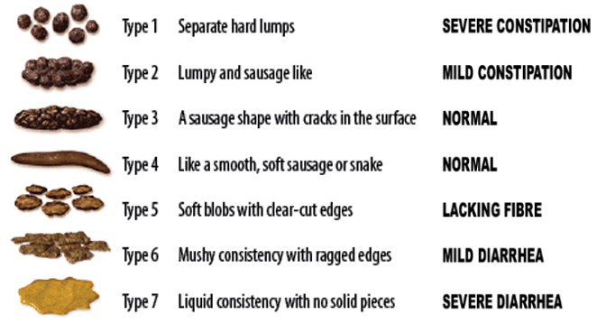
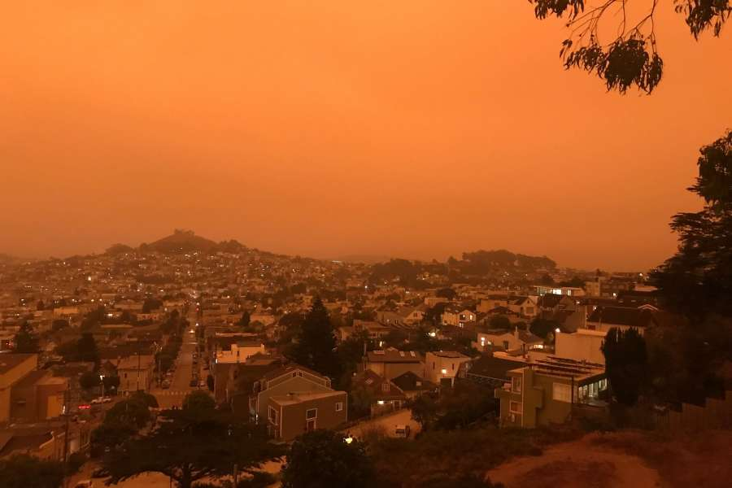
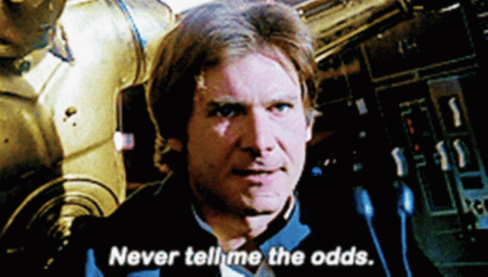
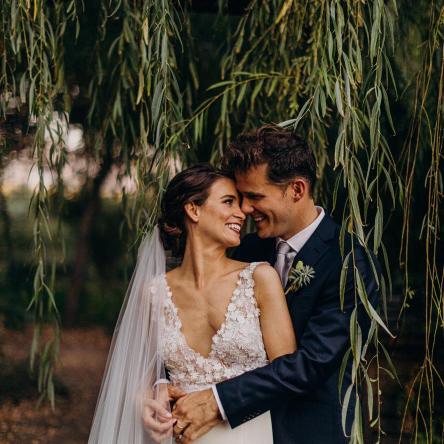
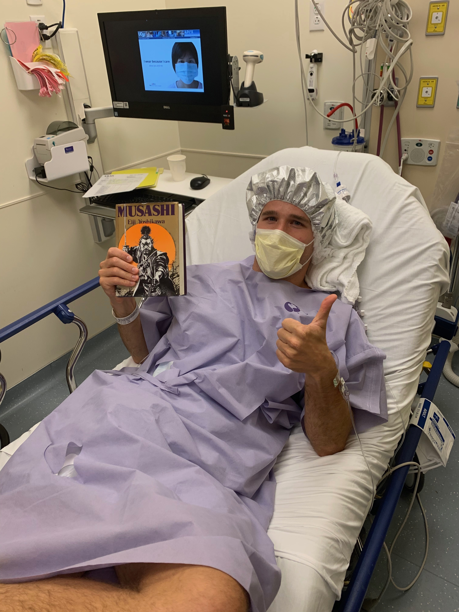
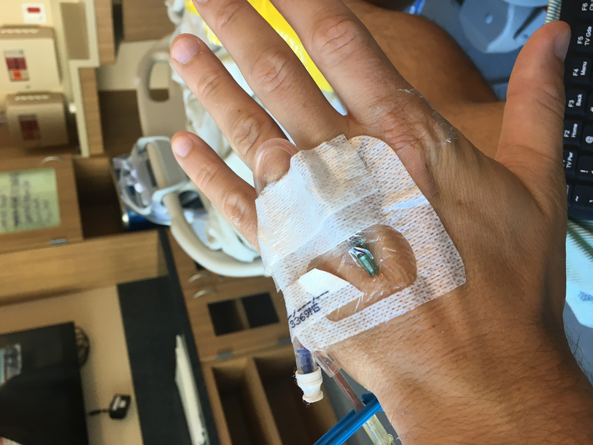
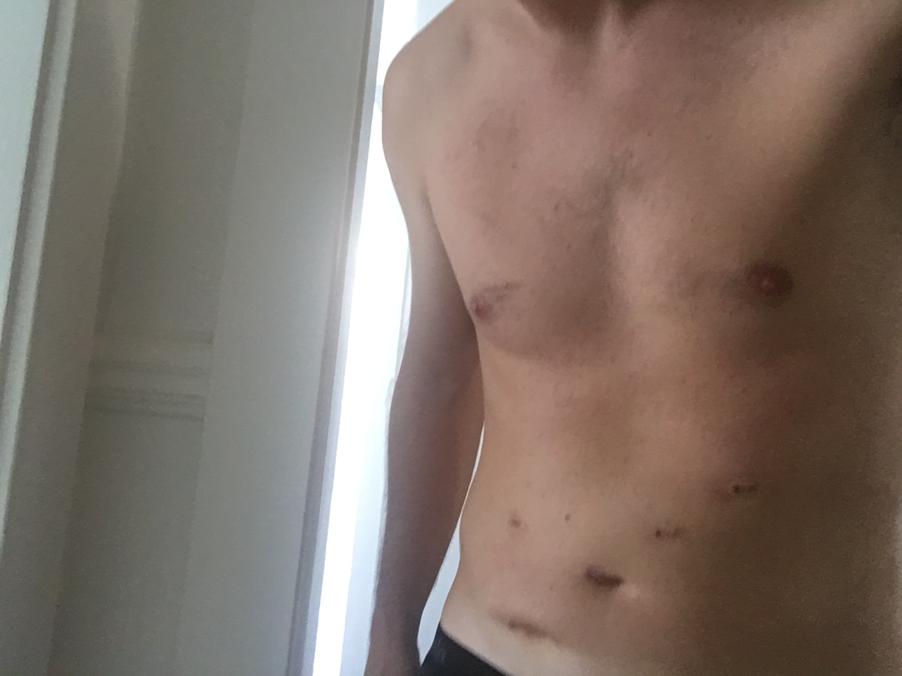
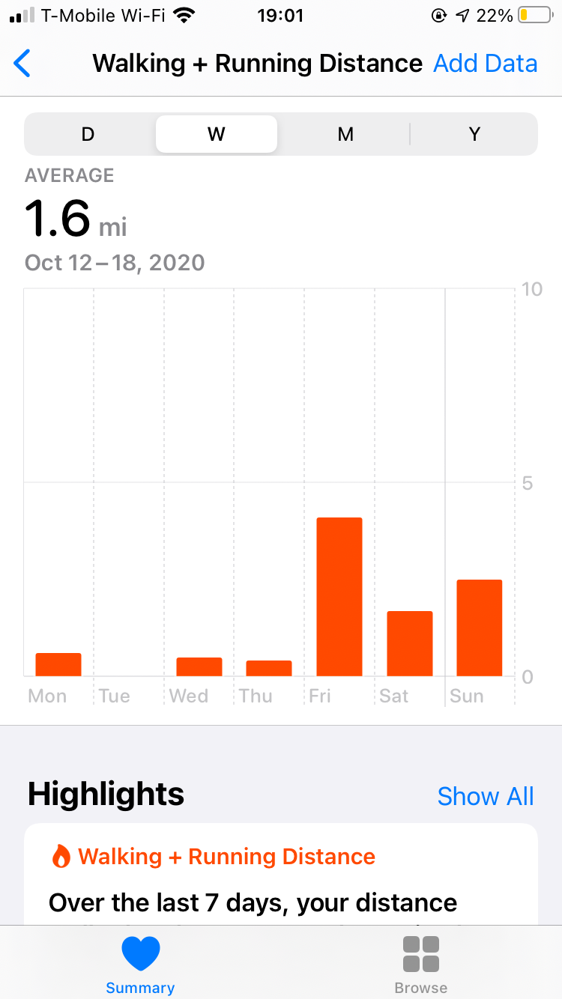

The giant robot looks like a WED Treadwell, [my favorite robot](/robots-i-love) of all the Star Wars droids. I admit, I was worried that it would look organic, like a Sentinel from The Matrix, with wriggling Dr. Octopus arms and pinchy pincers that pinch. But I'm calmed by the robot's EVE-like exterior.

The room is sterile. A dozen masked, gloved attendants in blue buzz. I imagine I'm an astronaut about to step into the rocketship capsule.

Except I won't be going anywhere on this particular journey, unless something goes very, very wrong. In fact, I've already been asked repeatedly by various staffers to describe what I'm expecting to happen in this room over the next few hours:

> "I'm here to remove my sigmoid colon via robotic surgery because of the cancerous tumor inside."

I'm 34 years old. It's October 12th, 2020. Five weeks ago I was diagnosed with colon cancer.

## Stool, bloody stool

I've always been a standing wiper. Not sure entirely why. I must have once, accidentally, touched a load of poo during a seated wipe. That sort of thing can change a person.

This charming anecdote does factor into our story, because it means I've always had a pretty good sense for my poo. Consistency, quality, and color, both in the bowl and on the TP. Did you know, there's even a seven-stage scientific classification system for your poo, called the [Bristol stool scale](https://en.wikipedia.org/wiki/Bristol_stool_scale)?!

I first noticed blood two or three years ago. On a monthly or so cadence, I'd wipe and notice a reddish tinge. Not bright red, more like muddy-red. Poopy-red. Initially, I thought little of it. Just a minor curiousity. It certainly didn't happen every time. Still, I decided to check off the `Blood in stool` box on the forms at my annual physical with my primary care doctor that year.

A brief aside on the phrase "your primary care doctor." Like in *Forgetting Sarah Marshall*, the last doctor I really thought of as "my doctor" was my pediatrician. Since "becoming an adult", I've lived in three cities in two countries, which means that I've generally had no idea who my primary care doctor is or was, only that I'd need to find one to give me a referral to get this wart on my foot removed.

Anyway, this season's Dr. Who told me not to worry about the blood. "It's probably hemorrhoids."

*WTF is a hemorrhoid?* I wondered to myself as I said to him, "Sounds good." Googled it after, and I learned that it's a vein that pokes out a little in your butt and doesn't really want to be poking out a little, so it bleeds. Seems like a thing that can happen, so I more or less returned to regularly scheduled programming and just dealt with the occasional poopy-red wipe. This doc also said I probably don't need to come for a physical for a few years, that annual physicals are a myth, dry land in a water world.

Fast-forward to 2020. Everything sucks. And the bloody wipes are making a resurgence. Because, of course, they are. About four months ago I noticed that my first poop of the day (I usually go 2x) would have this purple-red streak embedded in it, like a racing stripe from hell. And it would happen almost without fail every single morning. That just didn't seem right, no matter what Doctors of Physicals Past told me. And then one morning I felt like I had actual blood dripping from my butt.

Now I consider myself to be a mostly healthy person. I eat fairly well (even though I enjoy the occasional sourdough loaf and hazy IPA), I run and bike and hike regularly, I ran an IRONMAN in 2016 and a few ultramarathons since. I also don't like being sick (who does?). But, like with most things in my life, I want to be "good" at health. An ideal dental appointment for me would go something like this, "Wow, Charlie, these are the straightest, whitest teeth we've ever seen. We'd like you to come in and be the model for our Instagram ads and also be our 3D teeth model for dentures. Congratulations. Here's *two* free toothbrushes. You also never need to floss again."

Anything that deviates from that ideal makes me squirm and I do think I can fix anything. For what it's worth I still believe that, if I ever encounter a blue flower on a mountain-top, I'm only a few months of mystical training away from becoming Batman. I already have the cape (it's actually a Harry Potter robe, but, hey, I'm scrappy).

At the same time, I counterweight this with a mild touch of hypochondria. I'll see the poison oak in the mistletoe, so to speak. In this case it was a gift.  I googled again for *stool, bloody stool* and the dreaded *colon cancer* came back. Last time, I averted my eyes from these search results. But the bloody racing stripes weren't going away. I needed to get myself checked out.

Then I remembered an email from work: I was eligible for a [OneMedical](http://members.onemedical.com/membership_referrals?code=cha0014&source=sa) membership. I knew there was hype about OneMedical, certainly I've seen the billboards, but I still wasn't exactly sure what they were all about. It had been a few years since my last physical, as you know, so I was primary-care-less, with a bloody problem on my hands. I downloaded the OneMedical app, uploaded a photo of my insurance card, beep-boop, and I've got an appointment with a new doc in a few days in one of their nearby clinics. Already, I loved the experience - I could text my questions any time (see *foot wart* above). I'd describe OneMedical as a network of clinics with an app for scheduling appointments and texting with a doc. Sure, ZocDoc kinda does the scheduling thing, but Zocdoc feels like you're sifting through the classifieds. Gimme some non-user-generated-ratings-based curation, please. 

So, I met with the doc, liked him a lot, discussed my bloody poops, and sheepishly asked if he'd be my new primary care. He agreed, and he also referred me to UCSF for a colonoscopy. Sure, I'm young, and it's probably hemorrhoids, we agreed, but it's the only way to be sure.

After some jiggling about with the referral documentation, we finally get the colonoscopy scheduled for a few weeks later on Sept 9th.

Then, on August 28th, [Chadwick Boseman](https://en.wikipedia.org/wiki/Chadwick_Boseman) died of complications from colon cancer.

I wasn't freaked out. Okay, yes, I was very freaked out.

## Colonoscopies are not bad

What's a colonoscopy? It's a surgical procedure where the doctor goes all the way up your butt to see what's going on in there. You are completely knocked out, so you feel nothing. The only thing you need to do is what we in the business like to call "bowel prep."

Allow me to describe bowel prep: the day before the procedure, you will poop your ever-living guts out for a few hours until you are clean-as-a-whistle, stem to stern. They'll give you a prescription for a gigantic jug of clear laxatives that you'll drink every 15 minutes or so for a few hours. In today's toilet-paper hoarding economy, I'd make sure that you are stocked up, because this gets messy.

Other then the laxatives, you're allowed to drink clear liquids - which is confusing because you can enjoy such clear liquids as black coffee, Gatorade, broth, even green jello.

But that's it. Easy. I watched Stranger Things season 3 again during my bowel prep day. Might not have been the best choice, as I intermittently had to pause Netflix to contribute my own liquified form of the Mind-Flayer, but it got the job done, and I cried my way thru Dustin and Suzie's hymn to childhood, again, as expected.

Okay, next, I woke up on September 9th. My appointment is around 2 PM. Normal day, right?

<blockquote class="twitter-tweet">
A strange, apocalyptic orange-red sky looms over the Bay Area. Here&#39;s what you need to know. Read more: <a href="https://t.co/JxpYSnUPG9">https://t.co/JxpYSnUPG9</a> <a href="https://t.co/ZPOj4X3jRg">pic.twitter.com/ZPOj4X3jRg</a>
&mdash; San Francisco Chronicle (@sfchronicle) <a href="https://twitter.com/sfchronicle/status/1303799596515172352?ref_src=twsrc%5Etfw">September 9, 2020</a></blockquote> 

Nope.

I decide to walk over to the UCSF Parnassus building in the creepy Mars firelight, imagining I'm the last man on Earth (and hoping I don't step on my reading glasses). Carly makes a plan to pick me up in a few hours in our car.

As expected, the procedure was painless. My only bit of further colonoscopy advice here is to ALWAYS bring a book with you, to every single medical appointment you have, because there's always going to be some sort of delay or waiting room.

An hour or so later, I woke up feeling the feels of that post-anesthesia giddiness. Except no one else was happy. Carly was in the room, a surprise to me. And my doctor looked quite serious.

In addition to two small polyps (which she removed), my colonoscopy surgeon found a tumor in my sigmoid colon. At this point, I don't know a sigmoid colon from a semi-colon, but I knew it wasn't good news. Go 2020!

Despite the odds (my youth, my health), I now had cancer. Well, I probably had it for awhile, but we just found out I had it.

My doc said I'd need to meet with [UCSF's colorectal surgery team](https://www.ucsfhealth.org/clinics/center-for-colorectal-surgery), and I'd also need to get CT scans ("cat scans") to see if the cancer had spread anywhere else in my body.

And so began one of the worst weeks of our lives.

## A brief family history

Let's talk about the odds for a moment.

We've already discussed my vigorous, proto-Batman level of health. And how I'm a fresh-faced, occasionally-bearded, 34 year old with the heart of a child and the strength of a chimpanzee (no, that's a [humanzee](https://en.wikipedia.org/wiki/Humanzee)).

Speaking of unfortunate genetics, it turns out that I have some family history of colon cancer. 

Here's the scoop: my pops (that's cool talk for Dad) has had benign (non-cancerous) polyps in his previous colonoscopies. What's a poylp? It's a little growth thingy in your colon that may evolve into a tumor. Just like how a Charmander becomes a Charmeleon, polyps can grow bigger and more serious with more destructive power. Polyps are usually just snipped out during your colonoscopy and sent off for pathology (aka to see if they have cancer in them). Most do not. This is the case with my dad's polyp experience. Even though none of his have been cancerous, he still needs to go in for colonoscopies more regularly than those who don't have polyps.

My own tumor began as a lowly polyp, perhaps some ten years ago. We don't know exactly. But if I'd had a colonoscopy ten years ago, or five years ago, they might have seen it and snipped it out and you wouldn't be reading this.

If you go further up the Harrington tree, you'll learn that my dad's aunt (my father's mother's sister) died of colon cancer in her early 60s. And his other aunt (same side, same family) died of colon cancer in her 80s. Two factoids that I had no idea about until I asked my parents for their help filling out one of the many UCSF cancer history surveys. Also, on my mom's side, my grandfather's mother (my great-grandmother, who I never met) probably had colon cancer.

So, colon cancer is bouncing around in my family tree. But neither of my parents have it, and none of my grandparents had it, which I suppose is good. That said, I learned that my grandparents did have *other* sorts of cancers.

Getting confusing, right? I cannot stress this enough: **Learn your family's medical history and write it down in a note on your phone. You'll be asked for this info 10,000 times before every single appointment. But, more importantly, your family history can be a signal to you and your docs whether are "higher-risk" for certain conditions.**

I just didn't know about any of this. I knew there were some heart attacks in there, but not really about any of the cancer stuff. Ideally, each person would be given some sort of family history report when they're born or when they turn 18 or when they get their first Nintendo.

But that's just it. You don't get health info automatically. There's no one, other than you, to own your medical health story. **You must become your own health advocate.** Spoiler alert, but this is the number one lesson I learned during this entire cancer experience. Health literacy is just as important as financial literary or literacy literacy.

There are tools to help, and I'm still digging into them now. I'm much more excited now by the Apple Health stuff on iOS. I'm hoping it can become some sort of private, secure repository for my health data that I carry with me. For example, how many of you, dear readers, know your blood type? There's all sorts of little info-nuggets that you can track down NOW to pay-it-forward for FUTURE you. Cause, ain't nobody else gonna. It's like a scavenger hunt. Okay, enough proselytizing, dude.

## Stage-wise limbo

Back to our story, we've just learned that I have a cancerous tumor up my butt and we've also filled out a few frightening family history reports. This is where UCSF kicks it into high gear (and, my goodness, do I love UCSF? Yes, yes I do. They are absolutely, amazingly wonderful, competent, and life-changing!).

I'm now starting to get booked for all sorts of appointments, starting with the ones previously mentioned: (1) CT scans of my abdomen and chest and (2) then the consult with the colorectal surgeon.

Because, as I later learned from my colorectal surgeon (who is the best!), when colon cancer spreads, it usually does the evolution thing from cancerous polyp (Stage 1) into tumor (Stage 2). After that, it can break through the wall of the colon into the nearby lymph nodes (Stage 3). Finally, it becomes (Stage 4) if it spreads to other organs, the first often being the liver and the lungs. At least, this is how I understand the various stages. I'm sure I'm missing some technical details and nuance. When [reading about Chadwick Boseman](https://www.nytimes.com/2020/08/28/movies/chadwick-boseman-dead.html), you'll learn that he was initially diagnosed with Stage 3 colon cancer in 2016, which eventually became Stage 4. In sum, you want your stage to be as low as possible.

At this point, pre-CT scan, Carly and I have no idea what stage I'm at. Well, we do know that I'm somewhere from 2 - 4. These appointments are going to help us understand where I'm at. Specifically, the CT scans will tell us if I'm Stage 4 or not.

Carly and I are in a daze for most of the next week. And so are our parents and our siblings. I honestly can't remember how many friends we told at this point, I know a few, but not that many. I didn't know what to say or feel.

Much like the South Park lament "The Simpsons did it!", there's usually an [xkcd](https://xkcd.com/1048/) for whatever you're feeling or thinking:

As a wannabe stoic, I allow my negative visualization to run rampant. I'm thinking of the possibility that I've got only a few years (months?) left to live.

My CT scans are scheduled for Thursday afternoon and the meeting with the surgeon is Friday morning. Between then and now, we have the horrible Internet to do horrible searches and we have the two-page summary printout of my colonoscopy, replete with some terrifying photos of the tumor. The tumor looks like a cross between a tadpole and an eyeball (two things that I'd normally love). I don't like looking at this picture, at all, but the two-page summary somehow keeps traveling around our house, and no matter where I look, I see the pink tadpole eye staring back at me, and I wonder, "Are you my death sentence?"

### The sound of silence

On Thursday, Carly and I walk over to the UCSF CT scanning place. It's slightly less hostile to human life outside today, so that's nice. After checking in with the front desk, I quickly pass through the first waiting room into the second waiting room. There's always a second waiting room.

It's here I realize that the *sound* of a major health issue is rapidly opening and shutting hospital doors. I scribble this pithy witicism into the back cover of my paperback copy of [Flow](https://www.amazon.com/gp/product/0061339202/ref=as_li_qf_asin_il_tl?ie=UTF8&tag=whatrocks09-20&creative=9325&linkCode=as2&creativeASIN=0061339202&linkId=b76eed264fa980c5471f8c0cc351b2a1) and wait my turn with the CT machine. I'm given two bottles of "contrast" provided by reknowned-drink-maker General Electric to drink. These iodine cocktails will help the machine see my inside stuff. They taste like you're drinking printer ink. They're not that bad at all. Everyone else in here is at least fifty years old. I decide to do a five minute wall-sit to prove my vigor. Finally, I'm called back to the machine.

The CT machine looks like a coldsleep chamber crossed with a Weyland Corporation interdimensional portal. It's over in less than a minute.

### Plan of attack

The scans are done and now it's up to the radiologist to read them. I'm sure some neat TensorFlow or PyTorch deep learning computer vision model could help here, but I don't have access to the dataset.

The next morning we drive over to the [UCSF Center for Colorectal Surgery](https://www.ucsfhealth.org/clinics/center-for-colorectal-surgery). It's in the beautiful ghost town of the greater Chase Center-Mission Bay area. I look up at the sun before heading in, thinking, "The next time I see you, ball of gas burning billions of miles away (quoth Pumbaa), we'll know the CT results and we'll know the plan."

When I see the sun again, we do.

The CT scans were clean. There's no sign that the cancer spread to other organs, ruling out Stage 4. This is the best news ever.

The second best news we hear is that the tumor is in a relatively excellent spot for surgery. After an impromptu rectal exam that morning (hello!) to make sure there was no cancer in the rectum, my surgeon gives us an overview of the situation and a plan of attack.

He's going to remove my entire [sigmoid colon](https://en.wikipedia.org/wiki/Sigmoid_colon) (which is about a foot long), and then simply reattach the rectum to the rest of the colon. And he's going to do this all via "robotic surgery" (using the WED Treadwell-like [da Vinci Surgical System](https://en.wikipedia.org/wiki/Da_Vinci_Surgical_System)), so the scars will be teeny and the recovery much easier.

We'll only be able to tell if I'm Stage 2 or Stage 3 post-surgery. He's planning to remove the nearby lymph nodes and a pathology report will tell us if they're cancerous. If they're positive, it's Stage 3.

But, either way, we're getting this thing out of my butt, pronto.

Carly and I have a plan. We're planners. We needed this. A bit of our haze is lifted as we head into our next agenda item.

## Gettin' hitched

We got married (eloped, both technically and social-distanced-ly) on Sept. 30th!

Look at those oblivious smiles. Wait -- we aren't oblivious, I have cancer. We just love eachother.

Originally slated for 2019, then after bouncing around in 2020, our cute elopement threaded a very small needle with a teeny ceremony and it was beautiful and wonderful and just what we hoped for.

Now, onto our first act as a married couple: my surgery on Monday, Oct 12th (and another round of bowel prep the day before).

## Surgery ain't no joke

I don't have much to add about the surgery itself.  I was there. But I don't remember anything. Thank goodness. I also haven't yet watched any YouTubes of how the da Vinci robot works. I didn't want to know before the surgery, and I'm not quite ready now to see it.

I did remember to bring a book, though:

And, then, after glimpsing my many-limbed robotic friend in the surgery room, it's lights out.

The next thing I know it's five hours later and I'm in a hospital bed and calling Carly to give her my room number. The nurses in the recovery area are amazing. I'm hooked up to an IV and they're monitoring my "ins" and my "outs" (my foods and my pees and poops). They do this every four hours, so you're not exactly going to get a perfect night's sleep here, but it's great to know that they're paying good attention to you.

The big goal for me for the next 24 hours is to walk around. Being the Big Hero 6 that I am, I try to walk at 9 PM on the day of my surgery (which concluded around 6 PM), and I stand up, but my heart starts racing, so I slowly plop back into bed. Then, at midnight, my nurse helps my try again, and I do it. I shuffle around the hallway like a zombie, wheeling along my IV stand. It's a huge win. I end up walking six more times that day, between many Breath of the Wild sessions and most of The Umbrella Academy Season 2.

Sure, my guts feel like someone took a blender to them, but I'm in great spirits, with incredible support from the UCSF team, Carly, and my mom.

Side note that IVs are interesting. They're like open ports into your body, allowing the medical team to either remove or add fluids. I didn't expect that they'd just keep these ports open during your hospital stay, but they do. I guess that makes sense.

Another secret weapon of mine that aided in my recovery: this cute avocado buddy that my sister and her boyfriend sent me:

I'm squeezing this thing every time I'm jabbed with a needle (many, many times), using it as a pillow, and just loving it, cause it's so cute.

On Wednesday, after I've started farting and pooping again (great signs!), I'm sent home early.

### The future

I'm home and moving slow and still feel a bunch of surgical pain in my tummy, but overall feel so happy about my progress. I have some cool scars, which I'm thinking about submitting to the [@secret_buttholes Instagram](https://www.instagram.com/secret_buttholes/?hl=en):

On Thursday, I get a call from my surgeon. The pathology is back early. There's no signs that the cancer spread past the colon walls. The lymph nodes don't show any signs of cancer in them. Which essentially means I had Stage 2 cancer. Per my doctors, there's no immediate need for chemotherapy.

We did it.

I still have some upcoming follow-up appointments, and meetings with cancer genetics to learn if I'm genetically predisposed to cancers. And I'm sure I'll be doing many more colonoscopies and other tests in the future. And I'm still recovering from the surgery, too.

But I (think) I'm cancer-free now. Now, there's no way to know that little microscopic cancer cells didn't manage to break through somehow, or that I don't have cancer in some other random part of my body, so it's kinda arbitrary to say something like "cancer-free." But we do know, for sure, that my colon cancer tumor was safely removed and that my doctors are extremely pleased with the results and the signs that it hasn't spread.

### Hello, impostor's syndrome, my old friend

So, I guess that means I'm a cancer survivor.

Which is weird to say, because this whole thing happened *very* quickly. All I did was "bowel prep" for two days and then fall asleep and wake up with a painful stomach.

But I am a survivor.

In fact, I'm probably the luckiest cancer survivor ever, from my access to incredible people and resources at UCSF to the actual state of my tumor to my family and friends support network. I paid attention to my body (noticing the bloody poops) and got the support and encouragement needed to get checked.

UCSF has me signed up for a 5+ year relationship with their cancer survivors unit (I'll learn more in a few weeks when I have my first session). I'm excited about this, because I want to learn as much as I can about how to stay safe and healthy going forward. A few of my friends have told me that there's good research into fasting and Keto and their link with preventing colon cancers. I'm queuing up some [Tim Ferriss episodes with Dom D'Agostino](https://tim.blog/2015/11/03/dominic-dagostino/) about this topic.

My wife and my family are depending on me to stay healthy, and I'm going to do everything I can to do so. I'm going to own my health and be my own health advocate.

## Some thanks

It's now about a week and half out from my surgery. I'm doing better on the Bristol scale, but not quite back to normal yet.

Monday was my surgery. Tuesday didn't capture my walks, because I didn't have my phone on me. But I'm moving around again, and eager to get back to regularly-scheduled life.

Thank you for reading this story. I hope it is informative and shocking and helps you think about your health and the health of those around you. For example, Molly - my sister - is definitely going to have to get a colonoscopy ASAP.

Thank you to:
* My incredible, magical, beautiful *wife* Carly!
* My parents and my mother-in-law and our siblings!
* Our friends and family!
* UCSF!
* OneMedical!

Also, if I got anything wrong in this missive from a medical perspective, let me know and I can attept to correct the errata. This is meant to be *my understanding* of *my situation*, YMMV.