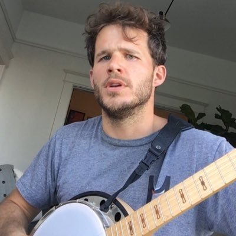

My name is Charlie Harrington. I'm a software engineer at [Cruise](https://www.getcruise.com) in San Francisco.

I love old computers, [books of all kinds](/library), building little things, playing music, and the Great Outdoors. Here's a grainy photo of me playing *Let It Be* on banjo:

I'm also in the middle of ~~writing~~ editing a novel about robots. More on that soon!

### You can follow me elsewhere as @whatrocks

* [Twitter](https://twitter.com/whatrocks)
* [GitHub](https://github.com/whatrocks)
* [Instagram](https://instagram.com/whatrocks)
* [Goodreads](https://www.goodreads.com/whatrocks)

Thank you for visiting my site.

-- *The Webmaster*
